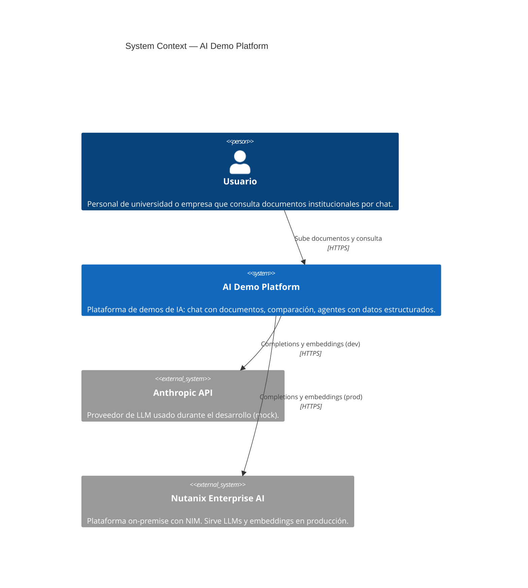

# 01 — System Context (C4 nivel 1)

El sistema en su entorno: quién lo usa, con qué sistemas externos
interactúa. Responde la pregunta de más alto nivel: _"¿qué hace y con qué
se conecta?"_

## Qué muestra el diagrama

- **Un solo actor humano** por ahora: la persona que sube documentos y los
  consulta. En el futuro podrían sumarse roles de admin (configurar qué
  documentos están disponibles, ver métricas).
- **Un solo sistema bajo nuestro control:** `AI Demo Platform`. Por dentro
  tiene varias piezas (ver nivel 2), pero desde afuera es una caja única.
- **Dos sistemas externos** intercambiables: `Anthropic API` en desarrollo,
  `NAI` en producción. **El mismo código** habla con uno u otro cambiando
  variables de entorno — gracias al patrón `LLMAdapter`
  ([`ADR-0004`](../adr/0004-llm-adapter-pattern.md)).

## Decisiones relevantes

- **¿Por qué dos proveedores intercambiables?** El hardware NAI estará
  disponible en el corto plazo, pero el desarrollo ya está en marcha. Usar
  Anthropic como mock 100%-compatible nos permite **avanzar sin bloqueo**.
- **¿Por qué LLMs externos y no entrenar el nuestro?** Out-of-scope para
  este proyecto: queremos demostrar el **valor del RAG corporativo**, no
  desarrollar un LLM.
- **¿Privacidad / datos?** En producción NAI corre **on-premise** dentro
  del datacenter del cliente. Los documentos no salen de su infraestructura.
  Ese es el principal diferencial comercial.

## Lo que sigue

→ Bajá al nivel 2 para ver las piezas grandes del sistema:
[`02-containers.md`](./02-containers.md).
