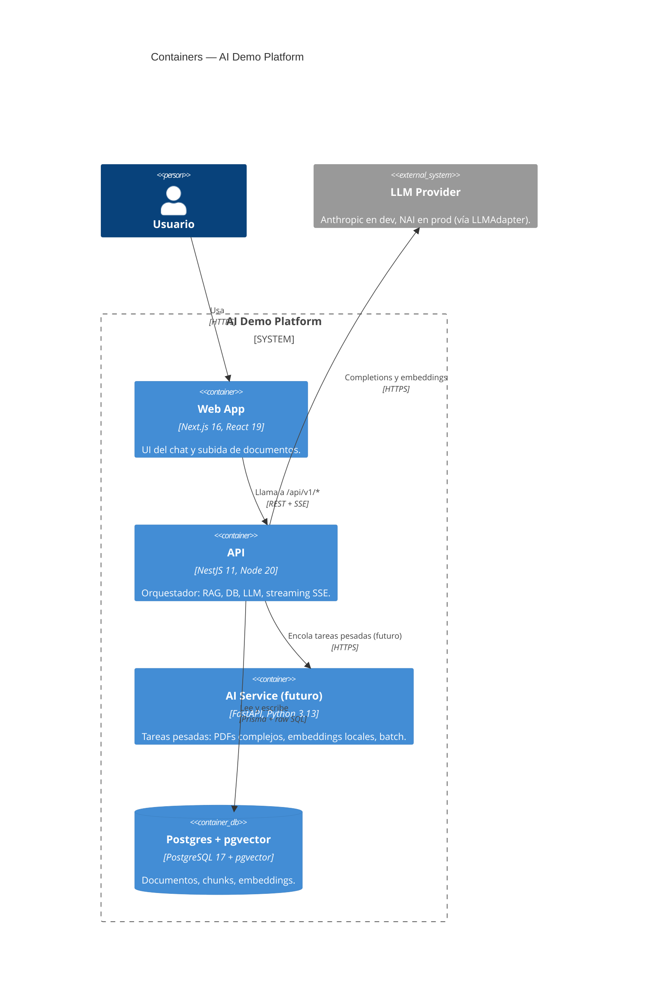

# 02 — Containers (C4 nivel 2)

Las piezas grandes que corren en algún proceso: apps, servicios, bases de
datos. Responde: _"¿qué tecnologías corren en qué lado y cómo se
comunican?"_

## Cada container, en detalle

### Web App — `apps/web`

- **Tecnología:** Next.js 16 (App Router), React 19, TypeScript.
- **Rol:** UI de los demos. Sube documentos al `api` y hace streaming del
  chat por SSE.
- **Componentes visuales:** los diseña Jorge en **Claude Design** y se
  traen acá para conectarlos. Nada de UI se inventa en este repo. Ver
  [`CLAUDE.md`](../../CLAUDE.md) sección _"Frontend — flujo de trabajo
  con Claude Design"_.

### API — `apps/api`

- **Tecnología:** NestJS 11 sobre Node 20, empaquetado con Webpack.
- **Rol:** **orquestador**. Siempre el punto de entrada. Hace RAG, habla
  con la DB, habla con el LLM, hace streaming SSE al frontend.
- **Por qué NestJS:** [`ADR-0002`](../adr/0002-nestjs-for-the-backend.md).

### AI Service (futuro) — `apps/ai-service`

- **Tecnología:** FastAPI sobre Python 3.13, en Docker.
- **Rol:** tareas donde Python tiene mejor ecosistema (extracción avanzada
  de PDFs con PyMuPDF, embeddings con modelos locales `sentence-transformers`,
  procesamiento batch, análisis estadístico con pandas).
- **Estado:** **no existe aún.** Entra cuando llegue el hardware NAI. Ver
  [`ADR-0003`](../adr/0003-typescript-first-python-later.md).

### Base de datos — Postgres + pgvector

- **Tecnología:** PostgreSQL 17 con la extensión `pgvector` 0.8.x.
- **Rol:** documentos, chunks y vectores de embeddings. **Una sola base**,
  sin vector DB dedicada. Ver
  [`ADR-0005`](../adr/0005-pgvector-over-dedicated-vector-db.md).
- **Hoy:** Docker Compose en `localhost:5434`.
- **Producción:** instancia gestionada en la infraestructura del cliente
  (o en el mismo cluster donde corre NAI).

### LLM Provider (externo)

- **Tecnología:** Anthropic API en desarrollo, NAI on-prem en producción.
- **Cómo se intercambian:** vía el `LLMAdapter` en `packages/llm-adapter`.
  Cambiar el provider es **una variable de entorno**. Ver
  [`ADR-0004`](../adr/0004-llm-adapter-pattern.md).

## Reglas de tráfico

- El **usuario nunca habla directo con la DB o el LLM.** Todo pasa por la
  `api`. Esto centraliza la lógica de negocio, el manejo de las API keys
  del LLM, y el rate limiting eventual.
- La `web` **no llama al LLM directamente** (importante: no exponemos la
  API key del LLM en el browser).
- La `web` consume **SSE** desde la `api` para streaming de tokens —
  protocolo HTTP estándar, sin WebSockets.

## Decisiones relevantes

- **¿Por qué Web y API separados?** El backend orquesta lógica y maneja
  secretos. El frontend solo dibuja UI. Es la separación canónica cuando
  hay un LLM detrás.
- **¿Por qué dos lenguajes (TS + Python eventualmente)?** Cada uno gana
  en lo suyo. Por ahora TS puro; Python entra cuando aporte. Detalle en
  [`ADR-0003`](../adr/0003-typescript-first-python-later.md).
- **¿Por qué un solo Postgres y no DBs separadas por demo?** Para 4 demos
  no hace falta. Si crece, se evalúa. _Simplest thing that works._

## Lo que sigue

→ Bajá al nivel 3 para ver qué hay dentro de cada container:
[`03-components.md`](./03-components.md).
