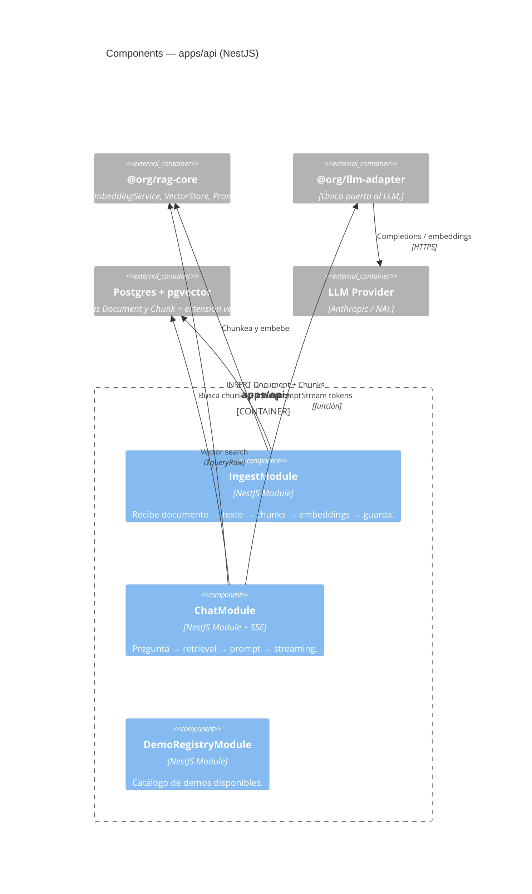
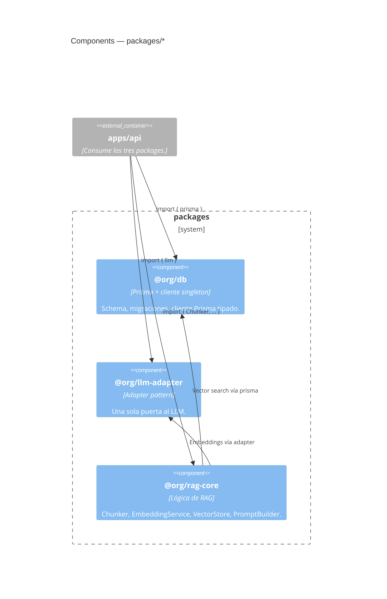

# 03 — Components (C4 nivel 3)

Qué pieza interna hace qué dentro de cada container. Responde: _"si tengo
que cambiar X, ¿qué carpeta toco?"_

Cubre el container `api` (el orquestador, lo más jugoso) y las librerías
compartidas en `packages/*`. La `web` se documenta cuando los componentes
de Claude Design estén integrados; la `ai-service` cuando exista.

## API — `apps/api` (NestJS)



### Módulos del backend

| Módulo               | Responsabilidad                                                               | Estado             |
| -------------------- | ----------------------------------------------------------------------------- | ------------------ |
| `IngestModule`       | Subida de documentos. Texto → chunking → embeddings → guardar en pgvector.    | 🚧 por implementar |
| `ChatModule`         | Pregunta → embed → retrieval top-k → prompt builder → streaming SSE.          | 🚧 por implementar |
| `DemoRegistryModule` | Lista de demos disponibles con su metadata (qué docs cubre, qué prompt usar). | 🚧 por implementar |

### Reglas de diseño en `api`

- **Toda llamada al LLM pasa por `LLMAdapter`.** Nadie instancia el SDK de
  Anthropic ni habla con NAI directo. Ver
  [`ADR-0004`](../adr/0004-llm-adapter-pattern.md).
- **El chat siempre stremea.** Nunca respuesta bloqueante — la experiencia
  de ver los tokens aparecer es parte del impacto.
- **Validación en el borde:** todo endpoint usa DTOs con `class-validator`.
- **Logging:** Logger de `@nestjs/common`, con prefijo por módulo.

---

## Librerías compartidas — `packages/*`



### `@org/db` — `packages/db`

- **Hoy:** schema con `Document` y `Chunk` (incluyendo columna
  `embedding vector(1536)` + índice HNSW con `vector_cosine_ops`),
  migraciones aplicadas, cliente Prisma singleton exportado. La
  dimensión 1536 viene del modelo OpenAI text-embedding-3-small —
  ver [`ADR-0008`](../adr/0008-openai-embeddings-for-dev.md).
- **API pública:**

  ```ts
  import { prisma, type Document, type Chunk, Prisma } from '@org/db';
  ```

### `@org/llm-adapter` — `packages/llm-adapter`

- **Estado:** placeholder. Por implementar.
- **Diseño objetivo:** una interface `LLMAdapter` con métodos como
  `complete(prompt): AsyncIterable<string>` y
  `embed(text): Promise<number[]>`. Dos implementaciones:
  `AnthropicAdapter` y `NaiAdapter`. La elección al arrancar la app vía
  variable de entorno.
- **Razón:** [`ADR-0004`](../adr/0004-llm-adapter-pattern.md).

### `@org/rag-core` — `packages/rag-core`

- **Estado:** placeholder. Por implementar.
- **Componentes planeados:**
  - **`Chunker`** — divide un texto en fragmentos. Strategy pattern:
    cada estrategia (párrafo, ventana deslizante…) es una clase
    intercambiable.
  - **`EmbeddingService`** — convierte texto en vector. Habla con el
    `LLMAdapter` por dentro.
  - **`VectorStore`** — guarda y busca vectores en pgvector. Único lugar
    que usa `$queryRaw` de Prisma.
  - **`PromptBuilder`** — arma el prompt final: pregunta del usuario +
    chunks relevantes + instrucciones del sistema.

## Reglas de dependencia entre packages

```
apps/api ───►  @org/db
       ├──►  @org/llm-adapter
       └──►  @org/rag-core ───►  @org/db
                           └──►  @org/llm-adapter
```

- `@org/db` no depende de nadie (capa más baja).
- `@org/llm-adapter` no depende de nadie (capa más baja).
- `@org/rag-core` puede usar las dos anteriores.
- `apps/api` puede usar las tres.
- **Las apps no se importan entre sí.** **Los packages tampoco importan
  apps.** Si esto se rompe, hay algo mal arquitectónicamente.

## Lo que sigue

→ Mirá los flujos en tiempo de ejecución:
[`04-runtime-flows.md`](./04-runtime-flows.md).
