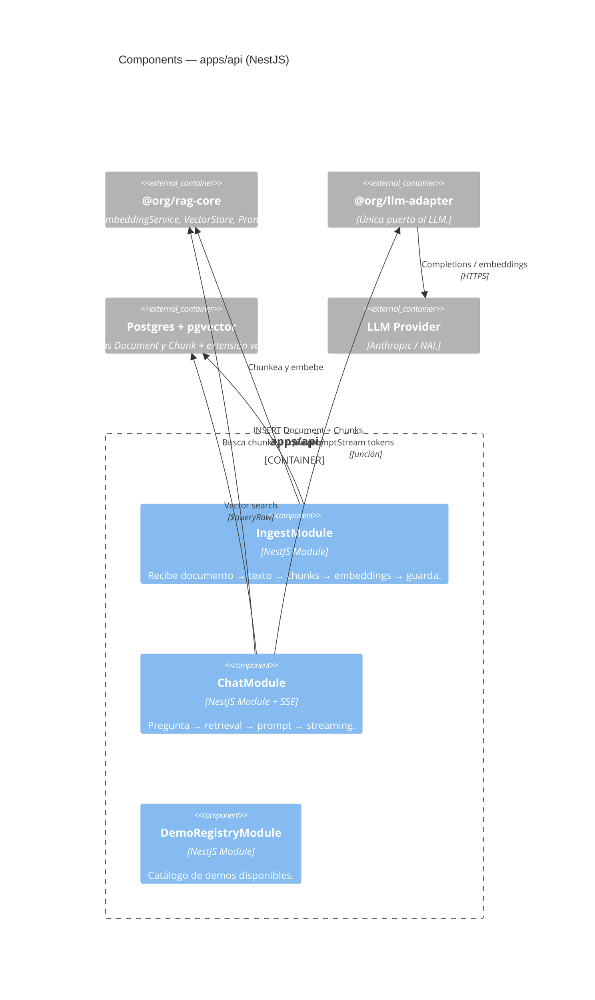
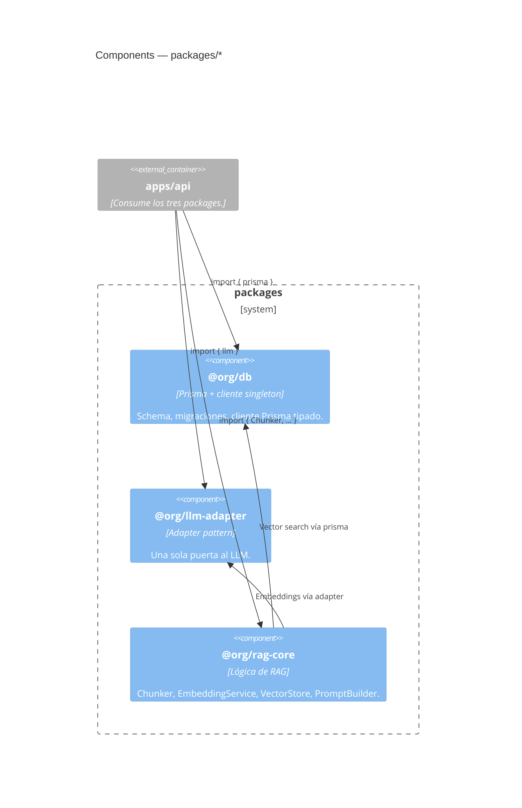

# 03 — Components (C4 nivel 3)

Qué pieza interna hace qué dentro de cada container. Responde: _"si tengo
que cambiar X, ¿qué carpeta toco?"_

Cubre el container `api` (el orquestador, lo más jugoso) y las librerías
compartidas en `packages/*`. La `web` se documenta cuando los componentes
de Claude Design estén integrados; la `ai-service` cuando exista.

## API — `apps/api` (NestJS)



### Módulos del backend

| Módulo               | Responsabilidad                                                                                                                          | Estado             |
| -------------------- | ---------------------------------------------------------------------------------------------------------------------------------------- | ------------------ |
| `IngestModule`       | Dos endpoints: `POST /api/v1/ingest` (JSON) y `POST /api/v1/ingest/file` (multipart PDF via `unpdf`) → texto → chunks → embeddings → DB. | ✅ implementado    |
| `ChatModule`         | `GET /api/v1/chat?q=...&demoId=...&topK=5` (SSE): embed → retrieval top-k → prompt → streaming de tokens.                                | ✅ implementado    |
| `DemoRegistryModule` | Lista de demos disponibles con su metadata (qué docs cubre, qué prompt usar).                                                            | 🚧 por implementar |

### Reglas de diseño en `api`

- **Toda llamada al LLM pasa por `LLMAdapter`.** Nadie instancia el SDK de
  Anthropic ni habla con NAI directo. Ver
  [`ADR-0004`](../adr/0004-llm-adapter-pattern.md).
- **El chat siempre stremea.** Nunca respuesta bloqueante — la experiencia
  de ver los tokens aparecer es parte del impacto.
- **Versionado URI:** los controllers no declaran versión; `main.ts` setea
  `defaultVersion: '1'` y todos heredan. Para sumar v2: solo el controller
  que cambia lleva `@Controller({ path: '...', version: '2' })`.
- **Validación en el borde:** `ValidationPipe` global con
  `whitelist + forbidNonWhitelisted + transform`; todo endpoint usa DTOs
  con `class-validator`.
- **DI para componentes externos:** las clases de `@org/rag-core` no llevan
  `@Injectable()` (no acoplamos los packages a NestJS). Se registran con
  `useFactory` en cada módulo que las necesita.
- **`prisma` se usa direct** (es ya un singleton de `@org/db`); no se envuelve
  en DI. Tests lo mockean con `vi.mock`.
- **Logging:** Logger de `@nestjs/common`, con prefijo por módulo.

---

## Librerías compartidas — `packages/*`



### `@org/db` — `packages/db`

- **Hoy:** schema con `Document` y `Chunk` (incluyendo columna
  `embedding vector(1536)` + índice HNSW con `vector_cosine_ops`),
  migraciones aplicadas, cliente Prisma singleton exportado. La
  dimensión 1536 viene del modelo OpenAI text-embedding-3-small —
  ver [`ADR-0008`](../adr/0008-openai-embeddings-for-dev.md).
- **API pública:**

  ```ts
  import { prisma, type Document, type Chunk, Prisma } from '@org/db';
  ```

### `@org/llm-adapter` — `packages/llm-adapter`

- **Hoy:** dos interfaces independientes (`ChatAdapter` y
  `EmbeddingsAdapter`) expuestas como singletons lazy, configuradas
  desde env vars `CHAT_*` / `EMBEDDINGS_*` al primer uso.
- **Providers implementados:**
  - `AnthropicChatAdapter` — chat en dev vía `@anthropic-ai/sdk`,
    streaming por eventos `content_block_delta`.
  - `OpenAICompatChatAdapter` — chat en prod (NAI) vía el SDK `openai`
    con `baseURL` configurable.
  - `OpenAIEmbeddingsAdapter` — embeddings; sirve tanto OpenAI nativo
    como cualquier endpoint OpenAI-compat (NAI). Diferencia: el
    `baseURL` del cliente.
- **API pública:**

  ```ts
  import { chat, embeddings, type ChatMessage } from '@org/llm-adapter';
  ```

- **Razón del diseño:** [`ADR-0004`](../adr/0004-llm-adapter-pattern.md)
  (patrón Adapter con env-driven provider) +
  [`ADR-0009`](../adr/0009-split-llm-adapter.md) (split en dos
  interfaces porque dev usa dos providers distintos).

### `@org/rag-core` — `packages/rag-core`

- **Hoy:** los cuatro componentes del pipeline implementados. Cobertura:
  unit tests sobre la lógica pura (`Chunker`, `PromptBuilder`,
  `EmbeddingService`) e **integration tests** del `VectorStore` contra
  un Postgres+pgvector real vía `testcontainers` (corren con
  `npm run test:integration`, también en el CI). Los integration tests
  verifican el SQL real, la semántica del operador `<=>` y el rollback
  de la transacción interactiva — cosas que los mocks no pueden cubrir.
- **Componentes:**
  - **`SlidingWindowChunker`** (implementa `ChunkerStrategy`) — ventana
    deslizante por caracteres con solapamiento. Strategy pattern: futuras
    estrategias (párrafo, ventana recursiva…) entran como clases nuevas.
  - **`EmbeddingService`** — wrapper sobre `embeddings` de
    `@org/llm-adapter` con batching (default 100 inputs por call).
  - **`VectorStore`** — `saveChunks()` + `searchTopK()` con `$queryRaw`
    sobre pgvector + índice HNSW. **El único lugar del proyecto que
    escribe SQL crudo** (Repository pattern).
  - **`PromptBuilder`** — `build({ question, chunks, systemPrompt? })`
    devuelve `ChatMessage[]` listo para `chat.completeStream()`. Expone
    `DEFAULT_SYSTEM_PROMPT` con las reglas anti-alucinación.
- **API pública:**

  ```ts
  import {
    SlidingWindowChunker,
    EmbeddingService,
    VectorStore,
    PromptBuilder,
    DEFAULT_SYSTEM_PROMPT,
  } from '@org/rag-core';
  ```

## Reglas de dependencia entre packages

```
apps/api ───►  @org/db
       ├──►  @org/llm-adapter
       └──►  @org/rag-core ───►  @org/db
                           └──►  @org/llm-adapter
```

- `@org/db` no depende de nadie (capa más baja).
- `@org/llm-adapter` no depende de nadie (capa más baja).
- `@org/rag-core` puede usar las dos anteriores.
- `apps/api` puede usar las tres.
- **Las apps no se importan entre sí.** **Los packages tampoco importan
  apps.** Si esto se rompe, hay algo mal arquitectónicamente.

## Lo que sigue

→ Mirá los flujos en tiempo de ejecución:
[`04-runtime-flows.md`](./04-runtime-flows.md).
