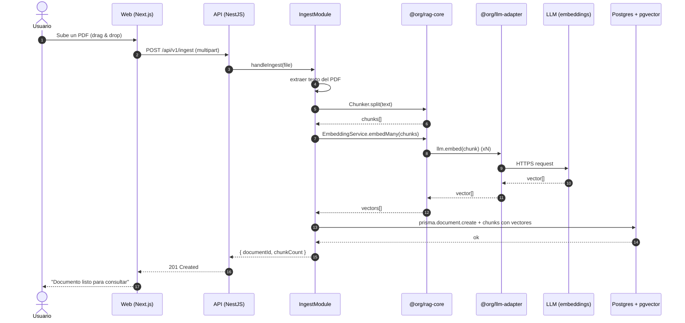
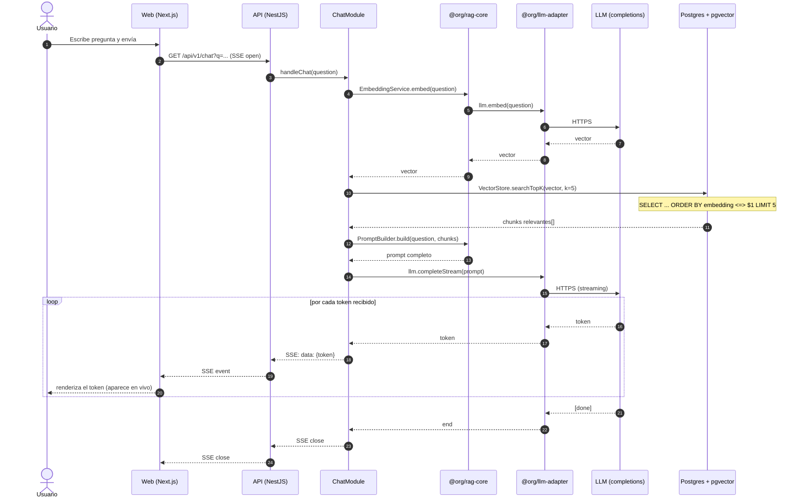

# 04 — Runtime flows

Cómo se comportan las piezas cuando un usuario hace algo. Complementa los
tres diagramas estructurales (1–3) con la **vista dinámica**.

Cubre los dos flujos centrales del Demo 01:

1. **Ingesta** de un documento (subir un PDF y dejarlo listo para consultar).
2. **Chat** con el documento (preguntar y recibir respuesta en streaming).

Los dos flujos están **diseñados** pero todavía no implementados.

---

## Flujo 1 — Ingesta de un documento



### Pasos clave

- **(1–2)** El usuario sube el PDF; la `web` solo lo reenvía al `api`. El
  browser no es lugar para extraer PDFs.
- **(4)** Extracción de texto. Hoy puede ser básica (`pdf-parse` u otro
  lib TS); para PDFs complejos/escaneados, en el futuro se delega al
  `ai-service` de Python con PyMuPDF.
- **(5–6)** Chunking. La estrategia se elige según el tipo de documento
  (ver `Chunker` en `rag-core`).
- **(7–11)** Cada chunk se embebe — los vectores se generan con una
  llamada al LLM provider (Anthropic en dev, NAI en prod) a través del
  `LLMAdapter`. **El IngestModule no se entera quién es el provider.**
- **(12)** Persistencia: `Document` y todos sus `Chunk`s en una sola
  transacción. La columna `vector` de cada Chunk se guarda con
  `$queryRaw` (Prisma no maneja el tipo `vector` directo todavía).
- **(13–15)** Confirmación al usuario.

### Errores comunes a manejar

- Archivo no soportado / corrupto → 400, mensaje claro al usuario.
- Texto vacío / muy chico → no se ingiere; el frontend muestra warning.
- Falla del LLM en embeddings → reintento con backoff, fallar _loud_.

---

## Flujo 2 — Chat (con streaming)



### Pasos clave

- **(4–8)** La pregunta se convierte en vector con el **mismo modelo de
  embeddings** que usamos para los chunks. Es crítico que coincida — si no,
  los vectores no son comparables.
- **(9)** Búsqueda por similitud en pgvector. `<=>` es el operador de
  distancia coseno. Top-5 chunks (k es configurable).
- **(11–12)** El `PromptBuilder` arma:
  - System prompt (instrucciones: "respondé solo con info del documento,
    cita el fragmento exacto").
  - Los 5 chunks recuperados como contexto.
  - La pregunta original.
- **(14–22)** Streaming. **El cliente LLM devuelve tokens de a uno.**
  Cada token se reenvía cuesta abajo: `LLMAdapter` → `ChatModule` → `api`
  (vía SSE) → `web` → DOM. La latencia percibida cae drásticamente.

### Detalle del streaming (SSE)

Server-Sent Events es HTTP/1.1 con `Content-Type: text/event-stream`. El
server mantiene la conexión abierta y emite eventos cuando tiene algo
nuevo:

```
data: {"token": "Según"}

data: {"token": " el"}

data: {"token": " reglamento"}

...
```

El navegador con `EventSource` consume cada evento. Más simple que
WebSockets (no necesitamos bidireccionalidad acá) y nativo del browser.

---

## Lo que NO está en estos diagramas (todavía)

- **Autenticación / multi-tenant.** El Demo 01 corre sin auth — los
  documentos son por demo, no por usuario.
- **Caché de respuestas.** Posiblemente útil para preguntas repetidas, pero
  out-of-scope para la primera versión.
- **Observabilidad.** Logs y métricas se suman cuando haya algo en
  producción.

→ Volvé al [`README de architecture/`](./README.md).
